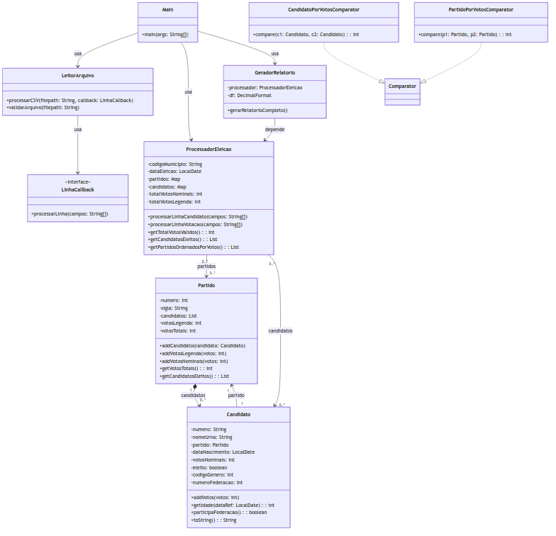

### Relatório

Este relatório apresenta a implementação, os testes realizados e uma declaração sobre bugs conhecidos para o sistema de análise de eleições municipais para vereadores, desenvolvido em Java seguindo o paradigma orientado a objetos. O sistema processa dados eleitorais a partir de arquivos CSV e gera relatórios estatísticos detalhados. O relatório segue as diretrizes fornecidas pelo professor, incluindo a descrição da implementação, a descrição dos testes e a declaração de bugs conhecidos.

---

#### Descrição da Implementação

O sistema foi modelado utilizando o paradigma orientado a objetos, com foco em encapsulamento, modularidade e reutilização de código. O problema foi estruturado de forma a representar os conceitos do domínio (candidatos, partidos, votos e relatórios) como entidades distintas, cada uma com responsabilidades bem definidas.

##### Principais Classes

As principais classes do sistema são:

- **`Main`**: Ponto de entrada do programa. Recebe os argumentos de linha de comando (código do município, arquivos de candidatos e votação, e data da eleição), instancia as outras classes e coordena o fluxo de execução.
- **`LeitorArquivo`**: Responsável por ler e validar os arquivos CSV de candidatos e votação. Utiliza um mecanismo de callback (`LinhaCallback`) para processar cada linha de forma eficiente.
- **`ProcessadorEleicao`**: Classe central que gerencia o processamento dos dados eleitorais. Armazena partidos e candidatos, processa votos e calcula as estatísticas necessárias para os relatórios.
- **`Candidato`**: Representa um candidato, com atributos como número, nome, partido, data de nascimento, gênero, votos nominais e status de eleição.
- **`Partido`**: Representa um partido político, contendo número, sigla, lista de candidatos, votos de legenda e votos totais.
- **`GeradorRelatorio`**: Gera os relatórios estatísticos com base nos dados processados, incluindo número de vagas, candidatos eleitos e votações por partido.
- **`CandidatoPorVotosComparator`** e **`PartidoPorVotosComparator`**: Classes auxiliares que implementam a interface `Comparator` para ordenar candidatos e partidos por votos, respeitando critérios de desempate.

##### Relacionamento entre Classes

Os relacionamentos entre as classes refletem as associações do domínio:

- **`Partido` e `Candidato`**: Existe uma associação bidirecional. Um `Partido` contém uma lista de `Candidato`s, e cada `Candidato` está associado a um `Partido`. Isso é implementado como uma composição, pois os candidatos pertencem ao partido.
- **`ProcessadorEleicao` com `Partido` e `Candidato`**: O `ProcessadorEleicao` mantém mapas (`Map`) que organizam partidos e candidatos por seus números, possibilitando acesso eficiente.
- **`Main` com `LeitorArquivo`, `ProcessadorEleicao` e `GeradorRelatorio`**: A classe `Main` depende dessas classes, instanciando-as e utilizando seus serviços para o processamento completo.
- **`GeradorRelatorio` e `ProcessadorEleicao`**: O `GeradorRelatorio` depende dos dados processados pelo `ProcessadorEleicao` para gerar os relatórios.

##### Tratamento de Exceções

O sistema foi projetado para ser robusto, tratando exceções de forma a evitar falhas inesperadas:

- **`LeitorArquivo`**: Lança uma exceção se o arquivo CSV não for encontrado ou não puder ser lido.
- **Validação de Dados**: Durante a leitura dos arquivos CSV, linhas com dados inválidos (como formato incorreto ou informações fora do município/cargo desejado) são ignoradas, com tratamento específico para exceções como `NumberFormatException`.
- **Processamento**: Erros de parsing ou inconsistências nos dados são capturados e tratados para garantir a continuidade da execução.

##### Diagrama de Classes UML

O diagrama de classes UML correspondente à implementação foi elaborado com base no código-fonte e ilustra a estrutura do sistema. Ele inclui:

- **Classes**: `Main`, `LeitorArquivo`, `ProcessadorEleicao`, `Candidato`, `Partido`, `GeradorRelatorio`, `CandidatoPorVotosComparator` e `PartidoPorVotosComparator`.
- **Atributos**: Principais variáveis de cada classe (ex.: `numero` e `nome` em `Candidato`).
- **Métodos**: Funções principais (ex.: `lerArquivo` em `LeitorArquivo`, `gerarRelatorios` em `GeradorRelatorio`).
- **Relacionamentos**: Associações (linhas com setas) entre `Partido` e `Candidato`, dependências entre `Main` e outras classes, etc.

---

#### Descrição dos Testes

Os testes foram realizados em duas etapas para garantir a corretude e a robustez do sistema:

##### 1. Execução com Casos de Teste Fornecidos

- **Arquivos de Entrada**: Foram utilizados os casos de teste fornecidos pelo professor para os estados do Espírito Santo (ES), Pernambuco (PE) e Acre (AC), processados nessa ordem.
- **Procedimento**: O programa foi executado manualmente para cada conjunto de arquivos (candidatos e votação) correspondente a cada estado, com os argumentos corretos (código do município, arquivos CSV e data da eleição).
- **Validação**: Os relatórios gerados foram analisados manualmente para verificar a exatidão das estatísticas, como número de vagas, candidatos eleitos e votações por partido. Todos os resultados estavam consistentes com os dados de entrada.

##### 2. Execução do Script de Verificação

- **Script**: Foi utilizado o script fornecido pelo professor para comparar os relatórios gerados pelo sistema com os resultados esperados.
- **Procedimento**: Após gerar os relatórios para os casos de teste, o script foi executado para identificar possíveis discrepâncias.
- **Resultados**: Não foram detectadas discrepâncias, confirmando que o sistema processou os dados corretamente e gerou relatórios precisos.

Esses testes cobriram diferentes cenários (estados com características distintas) e validaram a funcionalidade do sistema de forma abrangente.

---

#### Bugs

Após a realização dos testes descritos, **nenhum bug foi identificado** na solução. O sistema processou corretamente todos os casos de teste fornecidos, e o script de verificação não apontou discrepâncias nos relatórios gerados. Caso existam bugs não detectados, eles não são conhecidos no momento da elaboração deste relatório. Essa ausência de bugs conhecidos reflete a robustez da implementação e a eficácia dos testes realizados.